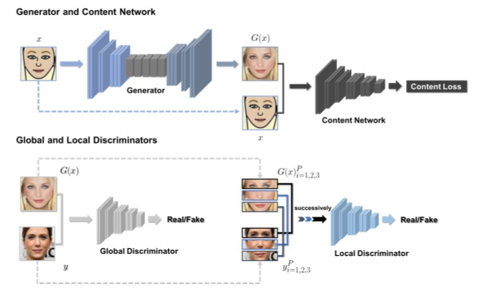
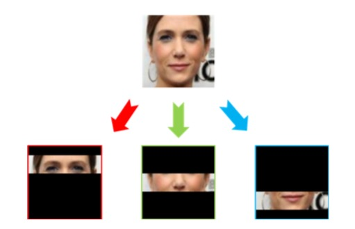

# Cartoon-to-Photo Facial Translation with Generative Adversarial Networks(ACML2018)

## Architecture of the proposed method(CP-GAN)


## The cropping and padding scheme

## Requirements

* python 2.7
* pytorch 0.3.0.post4


## Testing


```
Run testing.
```Shell
bash ./scripts/test_single_image.sj
```

## Training
```
Run training.
```Shell
bash run_train.sh
```


## Citation
If you find *CP-GAN* useful in your research, please consider to cite the following related papers:
```
@inproceedings{huang2018cartoon,
  title={Cartoon-to-Photo Facial Translation with Generative Adversarial Networks},
  author={Huang, Junhong and Tan, Mingkui and Yan, Yuguang and Qing, Chunmei and Wu, Qingyao and Yu, Zhuliang},
  booktitle={Asian Conference on Machine Learning},
  pages={566--581},
  year={2018}
}

```